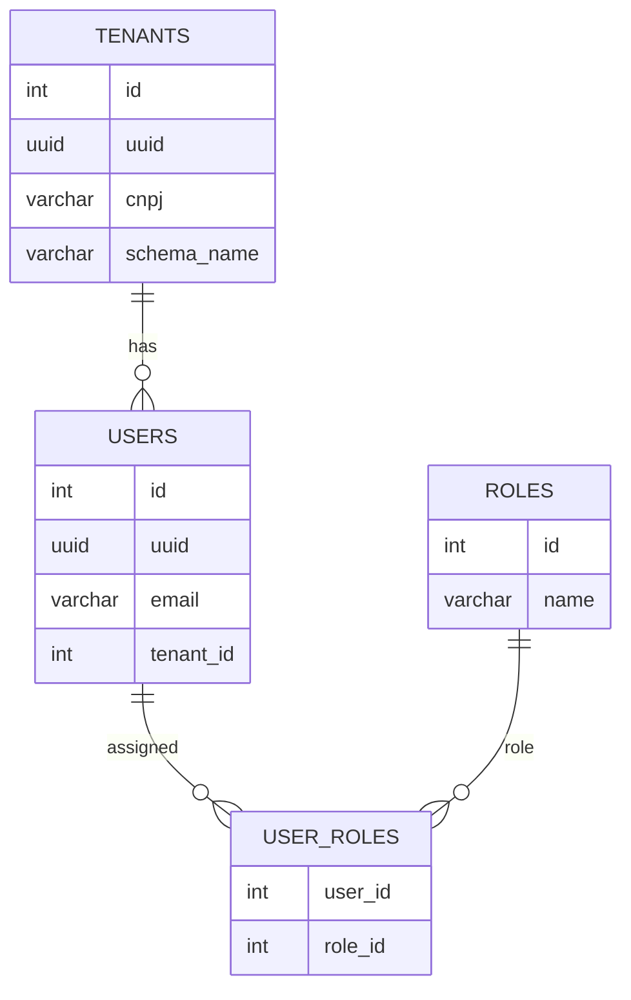
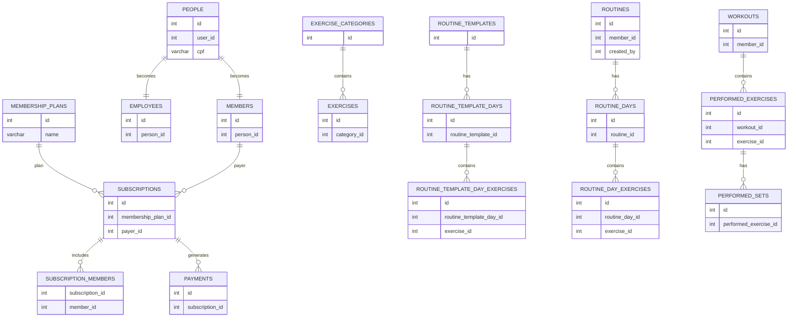

# FitControl

Um sistema multi-tenant para gerenciar academias

- [Sobre o sistema](#sobre-o-sistema)  
  - [Funcionalidades](#funcionalidades)  
  - [Diagrama de relacionamento](#diagrama-de-relacionamento)  
    - [Schema public](#schema-public)  
    - [Schema tenant](#schema-tenant)  
  - [Stack](#stack)  
  - [Detalhes técnicos](#detalhes-tecnicos)  
- [Rodando o projeto](#rodando-o-projeto)  
  - [Variáveis de ambiente](#variaveis-de-ambiente)  
  - [Rodando com docker](#rodando-com-docker)  
    - [Gerando a imagem com maven](#gerando-a-imagem-com-maven)  
    - [Usando docker-compose](#usando-docker-compose)

## Sobre o sistema

### Funcionalidades

- Gestão de pessoas:
  - Cadastro de alunos
  - Cadastro de funcionários com permissões por cargo
  - Atualização de dados pessoais
- Financeiro:
  - Cadastro de planos de assinatura
  - Visualização de assinaturas e pagamentos de alunos
- Instrutores:
  - Cadastro de exercícios separados por categoria
  - Templates de ficha de treino
  - Fichas de treino adaptadas para cada aluno
  - Visualização dos treinos realizados pelos alunos
- Alunos:
  - Visualização e seleção de plano de assinatura
  - Possibilidade de criar fichas próprias
  - Registro de treinos, podendo utilizar fichas de treino ou adicionar exercícios manualmente

### Diagrama de relacionamento

#### Schema public



#### Schema tenant



### Stack

- Backend:
  - Java + SpringBoot
  - PostgreSQL
  - Redis
  - Docker
- Frontend:
  - Vue.js
  - Tailwind CSS

### Detalhes técnicos

- Integração com gateway de pagamento Stripe
- Multi tenancy por schema
- Access tokens com JWT (sem salvar no banco e sem realizar chamadas para o banco de dados em toda requisição)
- Uso de refresh tokens
- Redefinição de senha através de token enviado por email
- Envio de emails através de SMTP

## Rodando o projeto

### Variáveis de ambiente
```
SMTP_HOST={host smtp}
SMTP_PORT={porta smtp}
SMTP_USERNAME={usuário smtp}
SMTP_PASSWORD={senha smtp}
SMTP_FROM={email que irá enviar os emails}

DB_HOST={host do banco de dados}
DB_PORT={porta do banco de dados}
DB_NAME={nome do banco de dados}
DB_USERNAME={usuário do banco de dados}
DB_PASSWORD={senha banco de dados}

REDIS_HOST={host do redis}
REDIS_PORT={porta do redis}
REDIS_PASSWORD={senha do redis}

JWT_SECRET={string de 32 bits para ser usada pelo JWT}

FRONTEND_URL={url para acessar o front}

GATEWAY_SECRET_KEY={chave secreta stripe}
GATEWAY_WEBHOOK_KEY={chave secreta webhook stripe}

NGROK_AUTH_TOKEN={token de autorização ngrok}
NGROK_URL={url fornecida pelo ngrok}
```

### Rodando com docker

#### Gerando a imagem com maven

Para criar uma imagem do projeto, execute o seguinte comando:

`mvnw spring-boot:build-image -DskipTests`

O comando irá buildar uma imagem chamada `fitcontrol:latest`, que ficará disponível no docker

#### Usando docker-compose

Utilizando `docker compose up` os seguintes serviços irão rodar:
- postgres
- redis
- ngrok (port forwarding para que a stripe possa chamar o webhook)
- fitcontrol
- frontend
